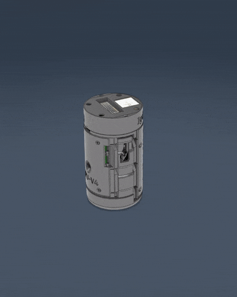
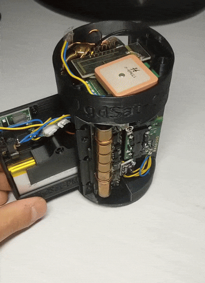

# IgdSat
The official source-code of IgdSat CanSat for you to build and improve at home!
This repo includes software, CAD and instructions on how to build it.





Follow us on social media!
 - Instagram: @cansat_igualada
 - TikTok: @igdsat
 - YouTube: @IgdSat

Join our discord server! https://discord.gg/XWwqkaNrvV

The repo structure is the following:

```
└── IgdSat/
    ├── Hardware (CAD)/
    │   ├── IgdSat-v2 --> Specific combination of modules
    │   └── Modules/ --> List of all modules
    │       ├── MPU
    │       ├── CM
    │       ├── PM
    │       ├── SM
    │       └── ...
    └── Software/
        ├── IgdSat --> Main code for IgdSat
        └── GroundStation --> Software of the web app
```

## Hardware:
The required hardware depends on which modules you want to build.
You can choose what features you want your IgdSat to have.
### Minimum hardware
- **Raspberry Pi Zero 2W** (22$) [Amazon](https://www.amazon.com/Raspberry-Quad-core-Bluetooth-onboard-Antenna/dp/B0CCRP85TR/)
- **Micro SD card** (8$) [Amazon](https://www.amazon.com/SanDisk-128GB-microSDXC-Memory-Adapter/dp/B08GY9NYRM/)
- **Battery switch** (0.1$/piece) [Amazon ES](https://www.amazon.es/dp/B086QGZRKG) [Amazon](https://www.amazon.com/Tnuocke-Vertical-Position-Latching-SS12F15-G5/dp/B099N3HFPG/)
- **Battery** (23€) [Amazon ES](https://www.amazon.es/dp/B09YQ393N2)
- **Battery charger/booster** (1.1$/piece) [Amazon](https://www.amazon.com/Adjustable-Lithium-Battery-Charger-Discharge/dp/B09WD9GCZC/)
- **M1-M2 self-threading screws** [Amazon](https://www.amazon.com/dp/B0CQJZH135/)
(and the PLA/PETG and TPU filament for 3D printing)

### Recomended hardware
- **4G GSM Module** (26.26$ or 31.28€) [Aliexpress](https://aliexpress.com/item/4000449295553.html)
- **APC220 RF Pair** (26.56$ or 31.01€) [Aliexpress](https://aliexpress.com/item/1005001710399951.html)
- **BMP280 sensor** (1.48$/piece or 1.7€/piece) [Amazon](https://www.amazon.com/HiLetgo-Precision-BMP280-3-3-Atmospheric-Pressure/dp/B07VNDZ6N4/) [Amazon ES](https://www.amazon.es/dp/B0BN1NXG4D)
- **Raspberry Pi Camera Module v3 Wide** (25.99$ or 39.95€) [Amazon](https://www.amazon.com/Arducam-Raspberry-Camera-Module-IMX708/dp/B0D2QK3QXQ/) [ES Tiendatec](https://www.tiendatec.es/raspberry-pi/camaras/1986-camara-oficial-raspberry-pi-v3-12mpx-wide--5056561800363.html) (You also have to buy the [CSI adapter](https://www.tiendatec.es/raspberry-pi/cables/1750-cable-flex-csi-camara-raspberry-pi-zero-38mm-8472496021678.html) as it's sold separately) 
- **Active Buzzer** (0.4$/piece) [Amazon](https://www.amazon.com/HiLetgo-Integrated-Sounder-Speaker-Electromagnetic/dp/B09L4M84M9/)
- **LED** Standard size
  
### Optional hardware
- **Sensirion SCD30 CO2 sensor** (14.84$ or 17.33€) [Aliexpress](https://aliexpress.com/item/1005004541153141.html)
- **RadSens radiation sensor** (53$) [Tindie](https://www.tindie.com/products/climateguard/dosimeter-with-i2c-radsens-arduino/)


## Software:
The source-code for the software is provided "AS IS" and it's documentation is under development. Despite that, it's all tested to work properly.
The main code for IgdSat's Raspberry Pi is tested to work on a clean `Raspberry Pi OS Lite` installation after the execution of the install.sh bash script with sudo privileges.
The instructions on how to use the Ground Station is listed on it's README.md file.

# Disclaimer
All the software on this repository is under the GNU GENERAL PUBLIC LICENSE. You're free to use, modify and share but you can't take possession of it; every distribution of this software should maintain the same license and mention it's author.
We appreciate every type of contribution to this project. You can submit issues, pull requests and create forks. For any questions about this project, check the FAQ and/or enter our discord server.

# FAQ
## What is IgualadaSat?
IgualadaSat is a project driven by 7 High School students with the aim of building a device to **compete in the CanSat competition**.  :rocket: 
We are a team from Catalonia, Spain with a passion for **tech** and **aerospace** :milky_way: so we decided to share our achievements with the international community :globe_with_meridians:

## What is CanSat?
*Extracted from cansat.esa.int *
A CanSat is a simulation of a real satellite, integrated within the volume and shape of a soft drinks can. The challenge for the students is to fit all the major subsystems found in a satellite, such as power, sensors, and a communication system, into this minimal volume. The CanSat is then launched by a rocket up to an altitude of approximately one kilometer, or dropped from a platform, drone, or captive balloon. During its descent, it should carry out a scientific experiment and/or a technology demonstration, achieving a safe landing, and analyzing the data collected.

## How is it structured?
It is structured with a **modular design**, so it speeds up the prototyping process and makes it easier to 3D print.  They are all fixed to the Main-Frame Module with self-threading screws. IgdSat consists of 6 modules:
- **Communication Module V4** (CM):  Integrates the necessary transceivers, receivers and antennas. *(SIM7600G-H, APC220 and antennas)*
- **Main Processing Unit V4** (MPU): Integrates the main computer and the HD camera, as well as a buzzer and an LED for debugging and recovery. *(Raspberry Pi Zero 2W, Raspberry Pi Camera Module v3 Wide)* 
- **Sensorial Module V2** (SM): Integrates the I2C sensors, such as radiation, temperature, humidity, pressure, and CO2 sensors. *(RadSens, SCD-30 and BMP280)*
- **Power Module V2** (PM): Integrates all the power-related components. This version uses a Li-ion battery* ( 3,7V 3000mAh li-ion battery, a switch and a charger and 5V booster)
- **Main Frame V2** (MF): Just a rigid plastic piece. It mechanically connects all the modules and ensures the proper integrity of the CanSat.
- **Amortiguation Module V1** (AM): Another integrity module to absorb the impact of landing. It is meant to be 3D printed with TPU or other similar flexible materials and with a special infill and specific printer settings.

\* We are working on a different Power Module that uses AA batteries


