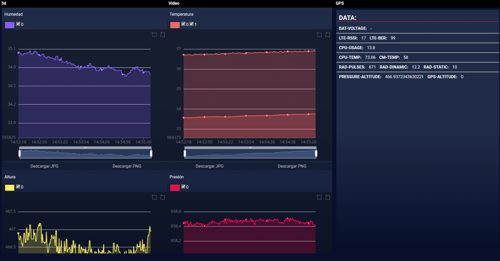

# Cansat 2024 Groundstation

The official IgdSat-GS (IgualadaSat Ground Station)
A web app based on Javascript Vanilla using node-modules such as echarts and express
Developed by @trmaa

The application is still in development.

## Installation

Make sure you have npm and node (v21.7) installed. 
You can install it through the webpage: https://nodejs.org/en/download/package-manager

Then install the dependencies with ´npm install´

To properly connect to IgdSat, you will have to replace the IP with the one you use for IgdSat in your environment in the following files: dist\public\components\video.html and dist\public\src\ws.js

Finally, just execute `node server` to start the web server!

